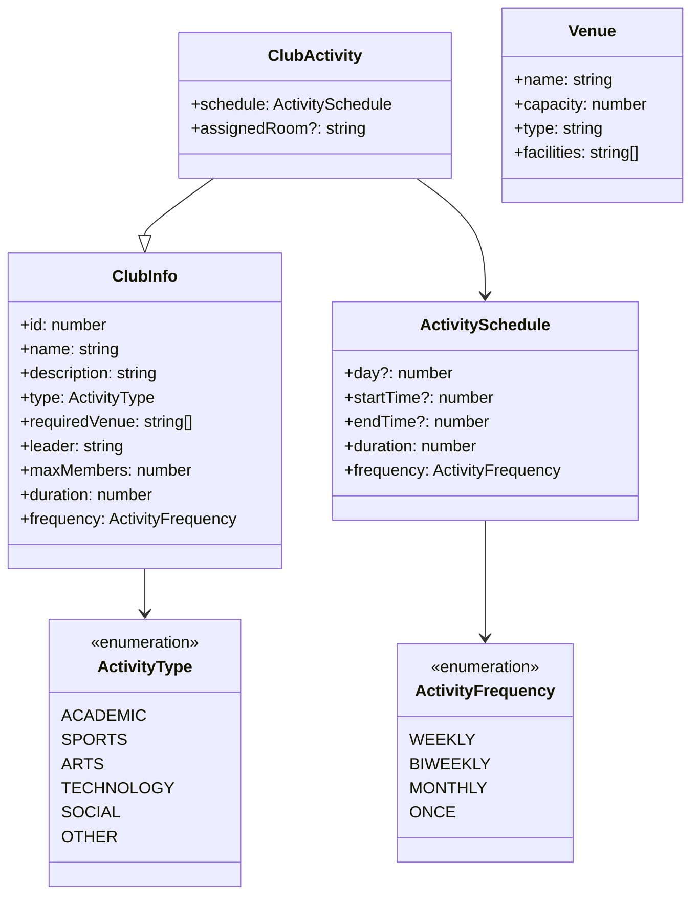

# 社团活动排期系统设计文档

## 1. 系统类图

## 2. 算法复杂度分析

### 2.1 时间复杂度

#### 活动安排算法 (scheduleActivities)

- 递归算法：O(R × D × T × V × A)
  - R: 房间数量
  - D: 天数 (5天)
  - T: 每天可用时间段数量 (10小时)
  - V: 每个房间的验证时间 O(1)
  - A: 活动数量
- 最坏情况：O(R × D × T × A)
- 贪心算法（回退方案）：O(A × R × D × T)

#### 时间冲突检查 (canScheduleAtTime)

- 时间复杂度：O(S)
  - S: 当前房间已安排的活动数量
- 最坏情况：O(A)，当所有活动都在同一个房间

#### 活动筛选 (filteredClubs)

- 时间复杂度：O(N)
  - N: 可用社团总数

### 2.2 空间复杂度

#### 主要数据结构

- 活动列表：O(A)
- 房间安排表：O(R × A)
- 临时状态（递归）：O(A)
- 总体空间复杂度：O(R × A)

## 3. 系统改进建议

### 3.1 功能增强

1. **智能推荐系统**

   - 基于历史数据推荐最优时间段
   - 使用机器学习预测活动参与度
   - 优化场地利用率
2. **冲突处理机制**

   - 添加优先级系统
   - 实现自动协调功能
   - 提供替代方案建议
3. **灵活的时间管理**

   - 支持自定义时间段
   - 添加节假日处理
   - 支持特殊时间要求

### 3.2 性能优化

1. **算法优化**

   - 实现并行处理
   - 添加缓存机制
   - 优化搜索策略
2. **数据存储**

   - 使用索引优化查询
   - 实现增量更新
   - 添加数据压缩
3. **用户界面**

   - 实现懒加载
   - 优化组件渲染
   - 添加预加载

### 3.3 可用性改进

1. **用户体验**

   - 添加拖拽排期功能
   - 提供日历视图
   - 增加批量操作功能
2. **错误处理**

   - 完善错误提示
   - 添加操作回退
   - 提供故障恢复
3. **报表功能**

   - 添加统计分析
   - 导出排期表
   - 生成活动报告
