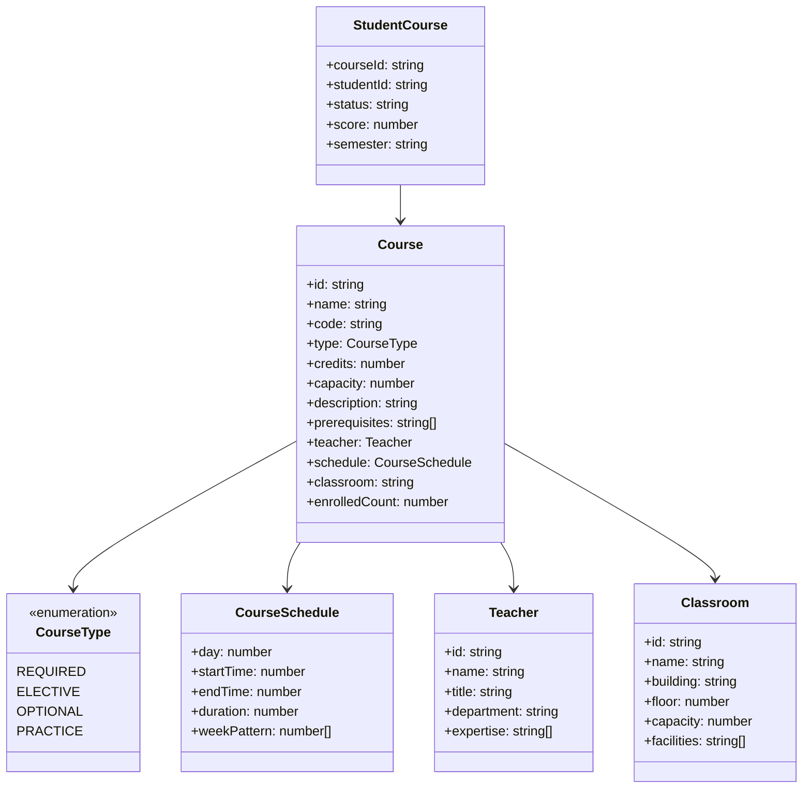

# 课程选择系统设计文档

## 1. 系统类图

## 2. 算法复杂度分析

### 2.1 时间复杂度

#### 课程分配算法 (courseAllocation)

- 主要算法：O(S × C × T)
  - S: 学生数量
  - C: 课程数量
  - T: 时间段检查复杂度
- 冲突检测：O(E)
  - E: 已选课程数量
- 优先级处理：O(log C)
- 总体复杂度：O(S × C × (T + log C))

#### 课程筛选 (filterCourses)

- 基本筛选：O(C)
- 条件匹配：O(C × F)
  - F: 筛选条件数量
- 排序：O(C × log C)

#### 选课验证 (validateSelection)

- 先修课程检查：O(P)
  - P: 先修课程数量
- 时间冲突检查：O(E)
- 总体复杂度：O(P + E)

### 2.2 空间复杂度

#### 主要数据结构

- 课程列表：O(C)
- 学生选课记录：O(S × E)
- 教室分配表：O(R × T)
  - R: 教室数量
  - T: 时间段数量
- 总体空间复杂度：O(C + S×E + R×T)

## 3. 系统改进建议

### 3.1 功能增强

1. **智能推荐系统**

   - 基于学生历史选课数据
   - 考虑课程难度和时间分布
   - 推荐最优课程组合
2. **课程规划助手**

   - 毕业要求分析
   - 学分规划建议
   - 课程路径可视化
3. **灵活的选课机制**

   - 分时段选课
   - 等待列表功能
   - 课程互换系统

### 3.2 性能优化

1. **数据库优化**

   - 添加适当索引
   - 实现查询缓存
   - 优化数据结构
2. **负载均衡**

   - 分布式处理
   - 队列机制
   - 峰值处理策略
3. **前端优化**

   - 数据分页
   - 按需加载
   - 状态管理优化

### 3.3 用户体验改进

1. **界面优化**

   - 课表可视化
   - 拖拽选课
   - 移动端适配
2. **信息展示**

   - 课程详情增强
   - 教师评价集成
   - 选课进度展示
3. **操作便利性**

   - 快速筛选
   - 批量操作
   - 历史记录
