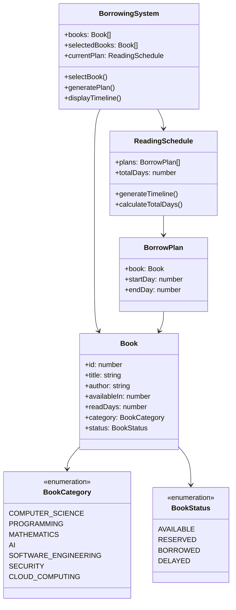

# 图书借阅系统设计文档

## 1. 系统类图

## 2. 算法复杂度分析

### 2.1 时间复杂度

#### 借阅计划生成算法 (generateBorrowPlan)

- 回溯算法：O(N!)
  - N: 选中的书籍数量
  - 每本书都需要考虑所有可能的时间安排
- 最坏情况：O(N! × D)
  - D: 最大可能的阅读天数
- 优化后的时间复杂度：O(N × D)
  - 通过剪枝和优先级排序优化

#### 时间冲突检查 (isValidPlan)

- 时间复杂度：O(P)
  - P: 当前计划中的书籍数量
- 最坏情况：O(N)，当所有选中的书都在计划中

#### 图书筛选 (filterBooks)

- 时间复杂度：O(B)
  - B: 图书馆总藏书数量

### 2.2 空间复杂度

#### 主要数据结构

- 图书列表：O(B)
- 借阅计划：O(N)
- 临时计划（回溯）：O(N)
- 总体空间复杂度：O(B + N)

## 3. 系统改进建议

### 3.1 功能增强

1. **智能推荐系统**
   - 基于用户阅读历史推荐书籍
   - 使用机器学习预测阅读时长
   - 优化阅读顺序建议

2. **借阅策略优化**
   - 添加图书优先级系统
   - 实现预约排队功能
   - 提供替代书籍建议

3. **灵活的借阅管理**
   - 支持续借功能
   - 添加假期特殊处理
   - 支持紧急借阅需求

### 3.2 性能优化

1. **算法优化**
   - 实现并行计算
   - 添加计划缓存
   - 优化回溯策略

2. **数据管理**
   - 使用高效的数据结构
   - 实现增量更新计划
   - 优化内存使用

3. **界面优化**
   - 实现分页加载
   - 优化时间线渲染
   - 添加搜索缓存

### 3.3 可用性改进

1. **用户体验**
   - 添加拖拽调整计划功能
   - 提供日历视图
   - 增加批量选书功能

2. **错误处理**
   - 完善借阅限制提示
   - 添加计划修改撤销
   - 提供应急借阅方案

3. **统计功能**
   - 添加阅读进度追踪
   - 导出借阅计划
   - 生成阅读报告
